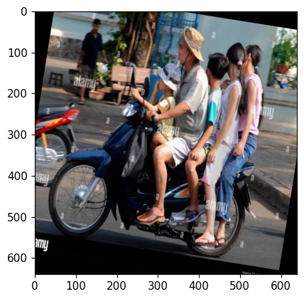
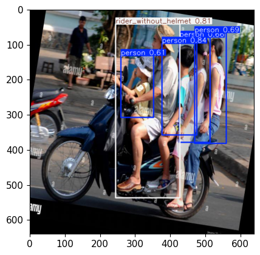
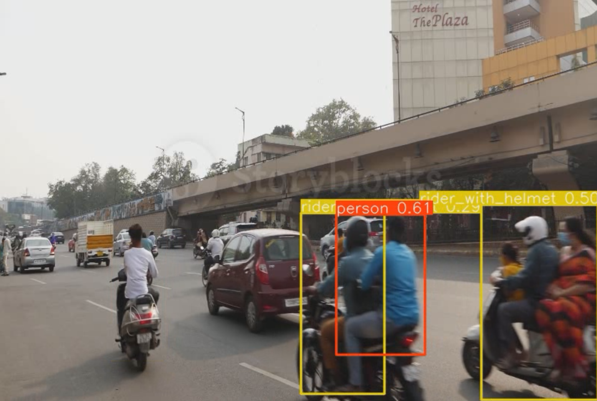

# Two-Wheeler-Violation-Prediction-System

This project implements a helmet detection system using the YOLOv5 object detection framework. The system is designed to detect whether motorcycle riders are wearing helmets and to count the number of riders on a single vehicle. It supports real-time detection on images, videos, and webcam feeds.

## Overview

The Helmet Detection System leverages YOLOv5 to accurately detect helmets and riders in various scenarios. It provides a robust solution for enforcing helmet-wearing policies and ensuring road safety.

## Features

- **Real-time Detection**: Supports real-time detection on video streams and webcam feeds.
- **Helmet and Rider Detection**: Identifies riders with and without helmets and counts the number of riders on a vehicle.
- **Image and Video Analysis**: Analyzes static images and video files for helmet detection.
- **Frame Saving**: Saves frames where riders without helmets or overloaded vehicles are detected.
- **Configurable Parameters**: Allows customization of detection parameters and model training configurations.

## Dataset

The dataset used in this project was created using Roboflow, a powerful tool for generating and managing datasets for machine learning projects. The images were manually annotated and labeled to include riders with helmets, riders without helmets, and the number of riders on a vehicle.

### Dataset Preparation Steps

1. **Source Images**
    - Total Images: 647
    - Classes: 3 (including riders with helmets, riders without helmets, and others)

2. **Train/Test Split**
    - Training Set: 453 images
    - Validation Set: 130 images
    - Testing Set: 64 images

3. **Preprocessing**
    - Auto-Orient: Applied
    - Resize: Images were resized to 640x640 pixels

4. **Augmentation**
    - Saturation: Adjusted between -25% and +25%
    - Noise: Added up to 1.05% of pixels

The preprocessing and augmentation steps were essential to improve the model's robustness and performance.

### Annotated Images

## Key Functions

- **Training**: The model is trained using the YOLOv5 framework on a custom dataset.
- **Detection**: The system detects helmets and riders in real-time on both images and video streams.
- **Saving Frames**: Frames where specific conditions are met (e.g., riders without helmets or overloaded vehicles) are saved for further analysis.

## Example Output

Here are examples of images processed by the model along with their predicted outputs:

#### Original Image

#### Predicted Image

**Predicted Output**:
- Number of persons: 2
- Riders without helmets: 1
- Riders with helmets: 1

### Video of Predictions

Here is an example video showing the real-time predictions made by the model:

## Conclusion

The Helmet Detection System provides a comprehensive solution for detecting helmet usage and rider count in various scenarios, ensuring enhanced road safety. With the use of YOLOv5 and a custom dataset created using Roboflow, this system offers accurate and efficient detection capabilities.
